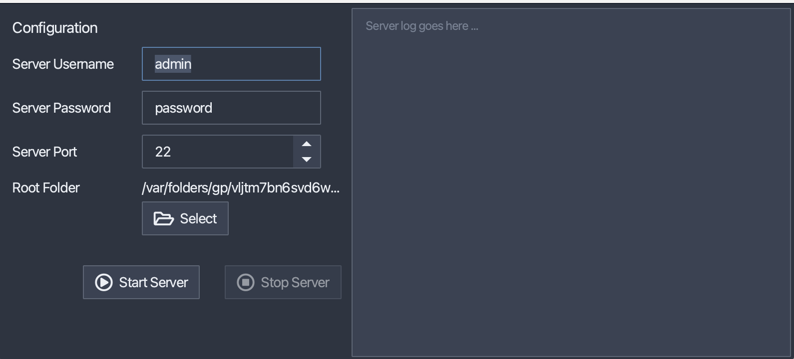

# Cross-platform graphical SSH File Server



This is simple cross-platform desktop GUI application embedding the Apache MINA ftpserver, which allows you to easily run an ftp-server in the foreground.

Download installer packages for Windows, macOS & Linux here: [https://bitbucket.org/mnellemann/jftpd/downloads/](https://bitbucket.org/mnellemann/jftpd/downloads/)


## Notes

- SSL/TLS not supported.
- [Ftp icons created by Freepik - Flaticon](https://www.flaticon.com/free-icons/ftp)


## Development

Information on how to build and package jftpd:

```shell
./gradlew build jpackage
```

### Windows

Download and install:

- Microsoft .NET Framework 3.5
- Wix Toolset 3.11.2 (or later)


### Linux

On Debian/Ubuntu:

- ```apt install dpkg-dev rpm```


### MacOS

Install xcode command line tools:

- ```xcode-select --install```
